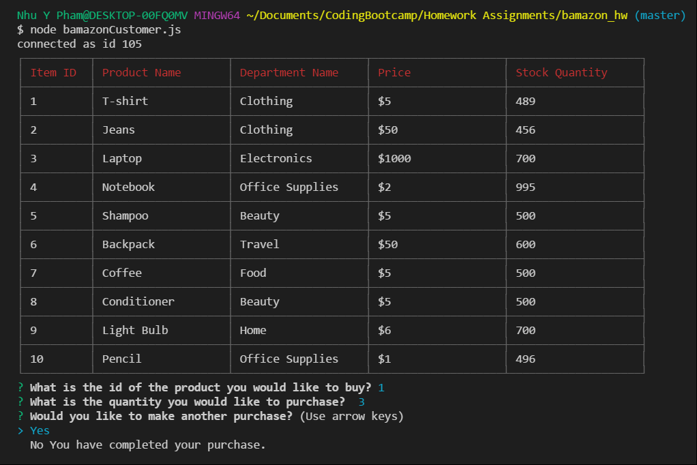
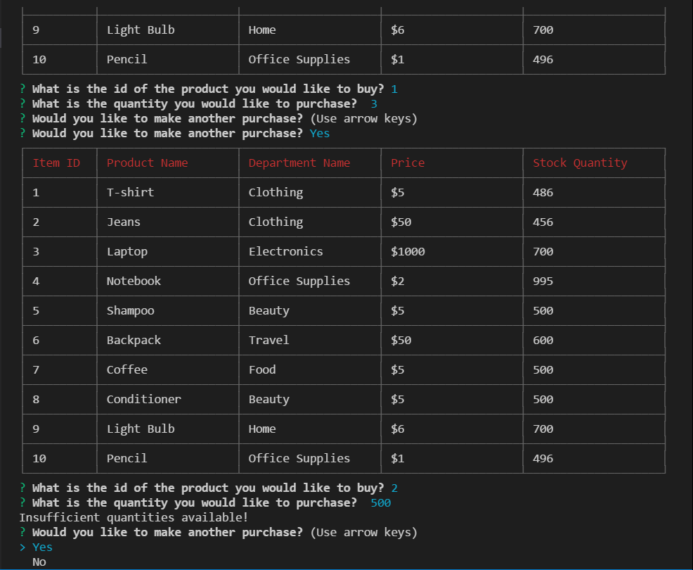
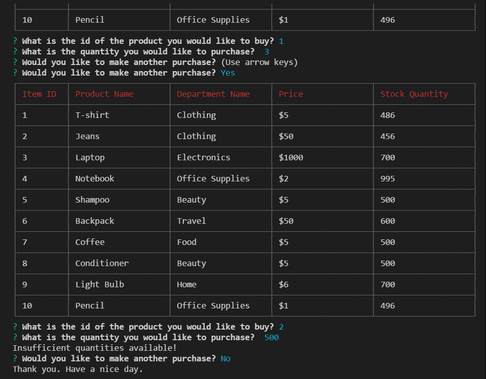
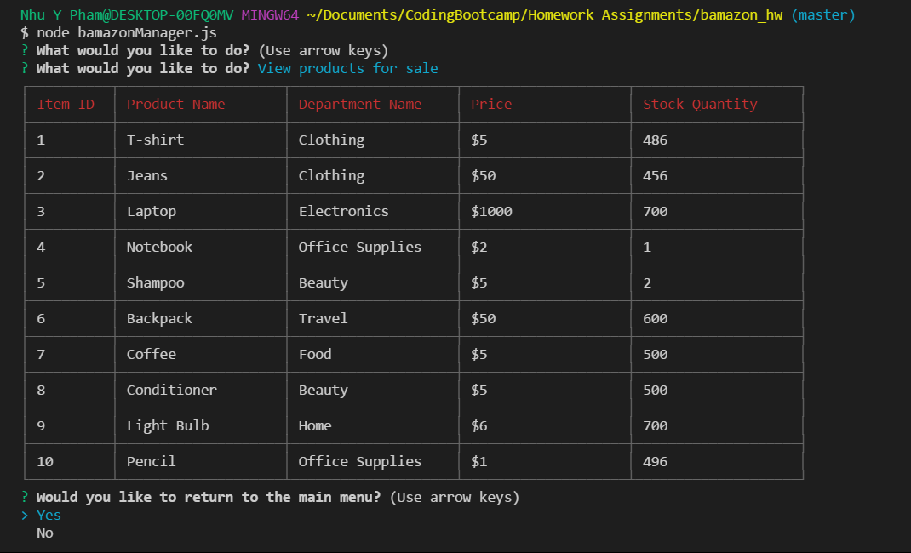
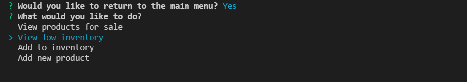
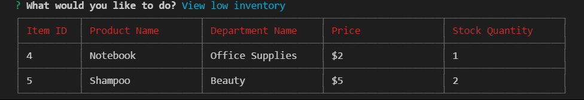

# bamazon_hw

###Bamazon Customer

Inventory table loads upon starting the Bamazon customer app and prompts user to specify the id of the product he/she would like to purchase

User is prompted to also input quantity he/she would like to purchase.  After purchasing, app allows user to make another purchase. 

If user purchases a quantity over the amount available, he/she will receive a notification stating that quantities are insufficient. 

The app continues to prompt the user to purchase more products until the user selects "No". 

###Bamazon Manager

Manager is prompted and allowed to select from several options. 

If the manager selects "View all products", a table will load and display all available products. 

If the manager selects "View low inventory", a table will display all products with stock quantities less than 5. 

